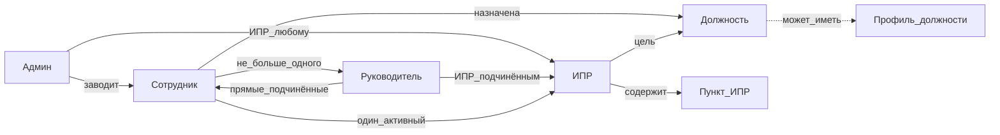

# Зафиксировать сотрудников и ИПР в CONTEXT и ADR

Гриль закрыт, края модели закрыты. Этот шаг только документы. Код, схема SQLite и экраны — после подтверждения формулировок, отдельным проходом.

Сейчас в коде нет человека. Есть [должность](src/db/schema.ts) (`jobs`), [профиль должности](src/db/schema.ts) (`profiles` + `profile_skills`) и общая cookie админа в [auth](src/lib/auth.ts). «Профиль» занят таблицей и **не** станет страницей человека. `compareJobs` в [src/lib/queries.ts](src/lib/queries.ts) возвращает `both-need-profiles`, если у любой из двух должностей нет профиля.

## Модель (для сверки, в CONTEXT диаграммы не будет)

ИПР содержит пункты. Снимок — свойство пункта из разрыва, не ребро «ИПР → пункт». У админа есть ребро к ИПР: он заводит план любому.

## CONTEXT.md

Глоссарий, не спецификация. **Что термин значит — здесь. Правила шкалы, стиль критериев и порядок правок контента — только в [docs/content-decisions.md](docs/content-decisions.md).** Не дублировать шкалу 1–3 как норматив.

`_Avoid_` крепится к термину, не общим списком. «Статистика как сущность» в `_Avoid_` не попадает.

### Кластер: справочник должностей

- **Должность** — узел лестницы OKP2. Профиля может не быть.
- **Профиль должности** — набор компетенций, уровней и критериев у должности. _Avoid_: профиль человека, профиль сотрудника, личный профиль.
- **Компетенция** — навык или обязанность из справочника, общая для всех должностей.
- **Уровень** — ожидание 1–3 у компетенции в профиле конкретной должности, не свойство компетенции самой. Правила шкалы — в content-decisions.
- **Критерий** — проверяемый текст ожидания на этой должности.
- **Обязанность** — компетенция типа `duty`; уровня у неё нет.
- **Разрыв** — разница двух профилей должностей на момент снимка: чего нет в текущей относительно цели или какой уровень в цели выше. Если у текущей должности профиля нет, её профиль считают пустым, разрыв = весь профиль цели.
- **Грейд** — назначенная сотруднику должность, не отдельный объект и не вывод из оценок. _Avoid_: грейд как сущность справочника, англоязычная шкала Junior/Middle/Senior.

### Кластер: люди и ИПР

- **Сотрудник** — человек со входом, назначенной должностью, флагом «активен». _Avoid_: пользователь.
- **Руководитель** — сотрудник на другом конце оргсвязи, не должность на графе. Не больше одного; без самоссылки и без циклов (A→B→A запрещён). Видит прямых подчинённых. После снятия или увольнения руководителя подчинённые остаются без него; нового ставит админ. ИПР принадлежит сотруднику и не переезжает.
- **Админ** — флаг на сотруднике: справочник и заведение людей, должность и ИПР любому. Не должность.
- **ИПР** — индивидуальный план развития к одной целевой должности с заполненным профилем. Не больше одного активного на сотрудника (инвариант домена; в коде позже — [src/lib/invariants.ts](src/lib/invariants.ts), не проверка только в форме).
- **Пункт ИПР** — либо снимок элемента разрыва (компетенция + требуемый уровень из цели), либо свободный пункт: чистый текст и статус, без компетенции и уровня. Статусы: не начат / в работе / закрыт.

Кабинет сотрудника показывает текущую должность и ИПР. Отдельного термина «статистика» нет.

## Закрытые края (в глоссарий или ADR — по одной фразе)

- Обновление снимка: слить по компетенции, статус сохранить; исчезнувшие пункты выкинуть; новые — «не начат»; свободные не трогать.
- Авто «выполнен», когда текущая должность стала целью, **срабатывает и при незакрытых пунктах**.
- Назначение должности, которая не цель: активный ИПР остаётся со старым снимком.
- Деактивация сотрудника: активный ИПР автоматически **отменён**, история остаётся, войти нельзя.
- Свободный пункт — чистый текст плюс статус.

## ADR

Четыре файла в [docs/adr/](docs/adr/). Bootstrap и судьба `ADMIN_PASSWORD` в ADR **не** пишем: это уже зона [docs/engineering-decisions.md](docs/engineering-decisions.md).

- `0001-grade-is-assigned-job.md` — грейд = назначенная должность; личных уровней 1–3 у человека в v1 нет.
- `0002-idp-is-gap-snapshot.md` — ИПР копирует разрыв (в т.ч. «текущая без профиля = пустой профиль»); не живой `/compare`. Плюс одна фраза: авто-выполнен и при открытых пунктах.
- `0003-manager-is-org-link.md` — оргсвязь, не должность; один руководитель; без циклов; ИПР не переезжает при смене руководителя.
- `0004-employee-accounts-public-catalog.md` — только домен и граница доступа: сотрудники входят логинами, админ — флаг, каталог открыт без входа, кабинет после входа. Ссылка на engineering-decisions за механикой первого админа. **Не** повторять `.env`, cookie, плейсхолдеры.

## engineering-decisions.md

В раздел «Секреты и админка» дописать, не заводя второй источник нормы:

- Пока нет ни одного сотрудника с флагом админа, `ADMIN_PASSWORD` создаёт первого.
- После этого `ADMIN_PASSWORD` **сессию не выдаёт**. Запасного входа мимо учёток нет.

## Ссылки

- [README.md](README.md) — указатель на `CONTEXT.md`.
- [.cursor/rules/project.mdc](.cursor/rules/project.mdc) — `CONTEXT.md` в обязательном чтении рядом с engineering-decisions и content-decisions.

Не трогать `src/` и seed, кроме как читать. Хостинг по-прежнему вне документов.

После записи — сверка формулировок. Реализацию кабинета не начинать, пока не скажете делать код.
