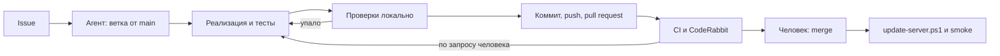

# Доработка по issue и проверка

Issue ведёт разработчик вместе с одним агентом. Агент может быть любым. Пошаговые инструкции для него — `AGENTS.md`. Здесь — кто за что отвечает и чем подтверждается результат.

## Роли

| Кто | Что делает |
|---|---|
| Разработчик | Пишет или уточняет issue, ставит задачу агенту, отвечает на его вопросы, решает по ревью, делает merge и выкладку |
| Агент | Ветка, код, тесты, локальные проверки, коммит, push, pull request. Дальше — только по запросу |
| CI | Повторяет проверки на чистой машине и проверяет обновление базы из `main` |
| CodeRabbit | Ревью diff по `.coderabbit.yaml` |

`main` защищена: в неё попадают только pull request с зелёным CI.

## Issue

Шаблон «Доработка или ошибка»: область, роль, «что сейчас», «что должно быть», 2–5 критериев «Дано / Когда / Тогда». Хотя бы один критерий — негативный: ошибочный ввод или отказ в доступе. Каждый критерий становится e2e-тестом, поэтому формулировка должна проверяться в браузере.

Агент останавливается и спрашивает, только если критериев нет, задача меняет правило предметной области или изменение схемы стирает строки. Остальное он делает сам.

## Проверки

Результат подтверждается командами, а не отчётом агента.

| Проверка | Команда | Локально | CI |
|---|---|---|---|
| Seed по контракту | `npm run check:seed` | да | да |
| Типы | `npx tsc --noEmit` | да | да |
| Сборка | `npm run build` | да | да |
| Сценарии | `npm run test:e2e` | да | да |
| Обновление базы | `npm run check:upgrade -- <база>` | по снимку от человека | да, в pull request |

**Seed.** Инварианты `docs/seed-contract.md`, ровно семь заполненных профилей, фикстура совпадает с `data.json` и целая сама по себе.

**Сценарии.** Playwright в `e2e/`. Тестовый сервер — `next dev` на порту 3100 с отдельной базой `tmp/e2e.sqlite`, которую seed загружает заново перед каждым прогоном. Локально тесты идут в Edge (Chromium через корпоративный прокси не скачивается), в CI — в Chromium. Перед прогоном dev-сервер на 3000 остановить: оба пишут в `.next`, и тестовый запуск сам откажется стартовать при занятом порте. При падении в CI отчёт и трассировка лежат в артефакте `playwright-report`.

**Обновление базы.** То, что произойдёт на сервере после `update-server.ps1`: `migrate()` новой версии впервые открывает базу старой схемы. В CI код `main` собирает базу (`db:seed` и `scripts/upgrade-base.ts` заполняют все таблицы), затем `check:upgrade` открывает её кодом pull request. Проверка работает на копии, запускает `migrate()`, `integrity_check` и `foreign_key_check` и падает, если таблица пропала или в ней стало меньше строк. Сознательная потеря строк записывается в `ALLOWED_LOSS` в `scripts/check-upgrade.ts` — это видно в diff, и такое решение принимает разработчик.

Локально эту проверку стоит прогнать на реальных данных, если pull request меняет таблицы с данными сотрудников или ИПР. Снимок с сервера снимает разработчик: в `C:\apps\programming-profiles` выполнить `npm run db:snapshot -- data\profiles.sqlite <папка вне сайта>\g4-base.sqlite`, перенести файл в `tmp\` и запустить `npm run check:upgrade -- tmp\g4-base.sqlite`. В снимке учётки и хэши паролей: только `tmp/`, никуда не пересылать, после проверки удалить. Копировать базу только через `db:snapshot`: она в режиме WAL, и `Copy-Item` одного файла теряет записи из `-wal`.

## Pull request и ревью

- Описание — по шаблону: `Closes #N`, что изменено, фактический результат проверок, влияние на данные, что сделать после выкладки.
- После push CI и CodeRabbit отрабатывают сами. Что делать с замечаниями, решает разработчик и даёт агенту задание. Агент исправляет или отвечает отказом со ссылкой на ADR или правило, затем повторяет проверки.

## Merge, выкладка, закрытие

1. Разработчик смотрит diff и зелёный CI и делает merge.
2. На сервере — `scripts/update-server.ps1` по `docs/update-server.md`. Smoke: сайт открывается, вход проходит, главный сценарий issue работает.
3. Issue закрывается через `Closes #N`. Если выкладка что-то показала — комментарий в issue.
4. Уроки: повторяемый сбой стека — `.cursor/rules/learned-cases.mdc`; продуктовое решение — `CONTEXT.md` или ADR; повторяющееся замечание ревью — `.coderabbit.yaml`.
